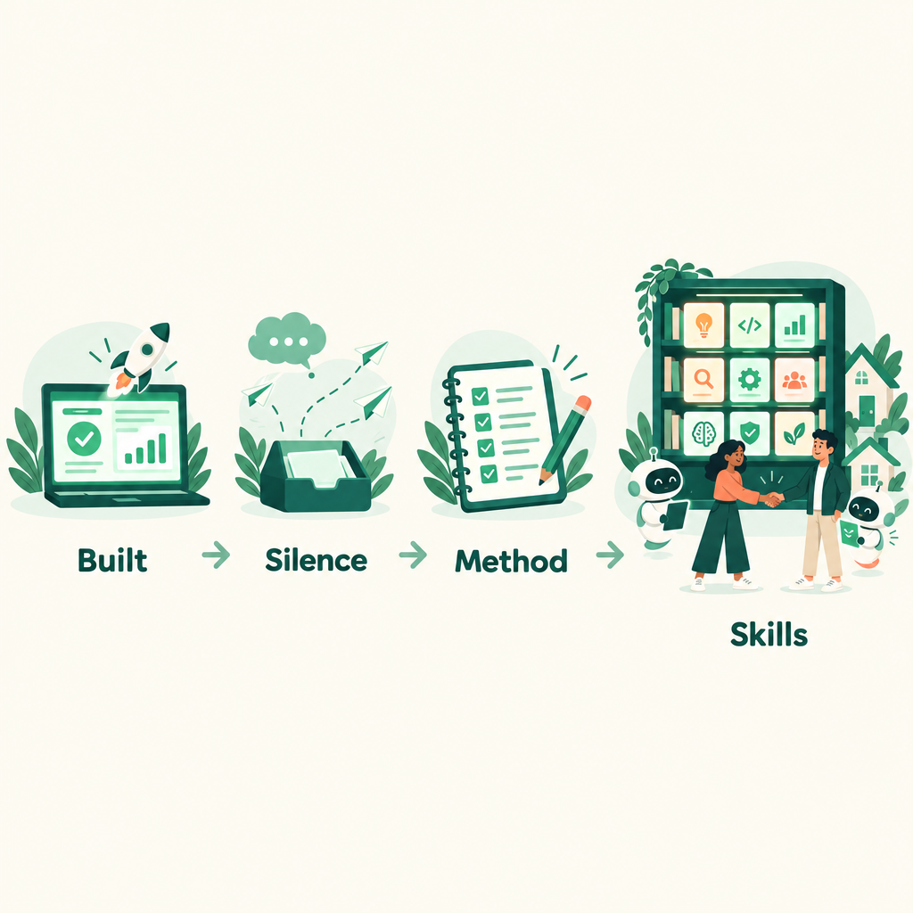
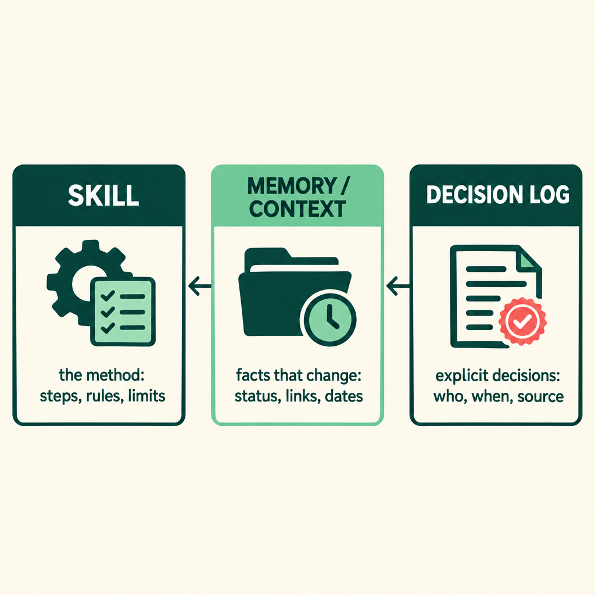
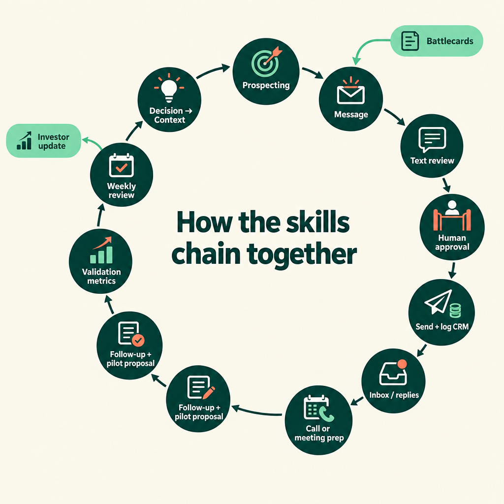
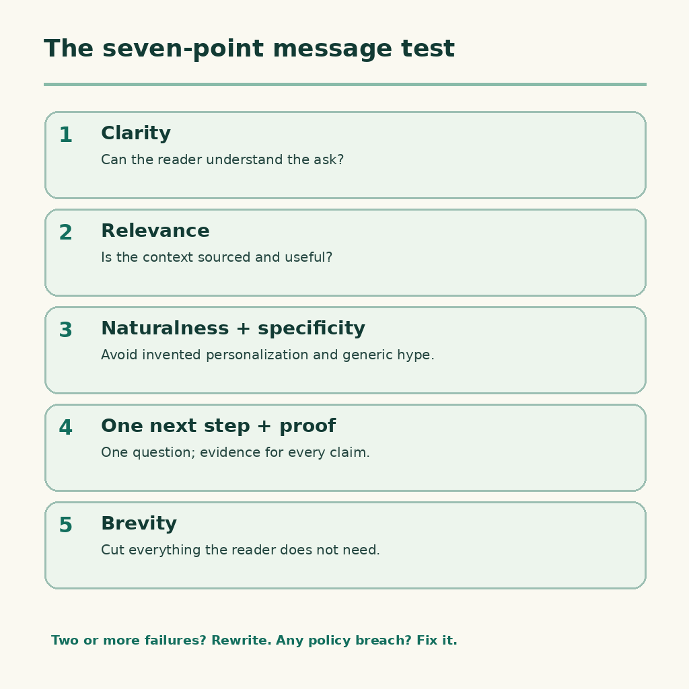
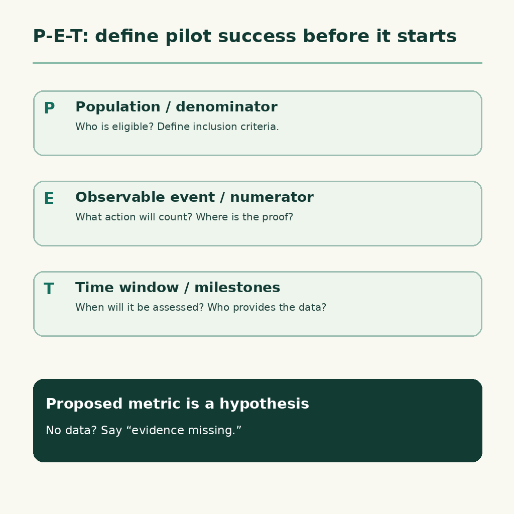
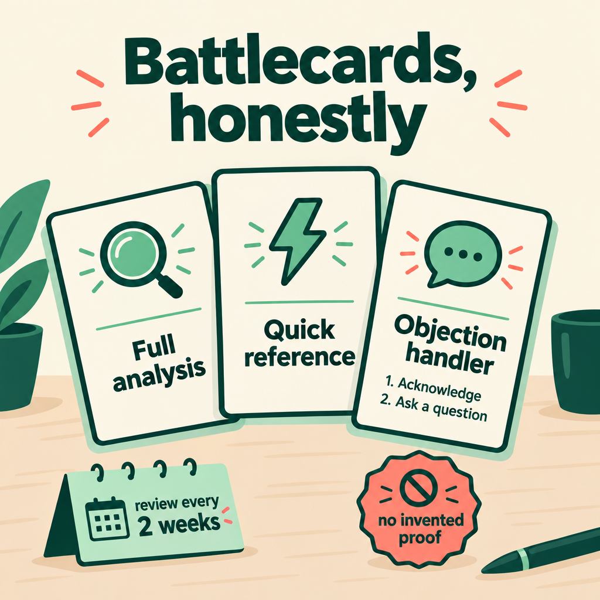
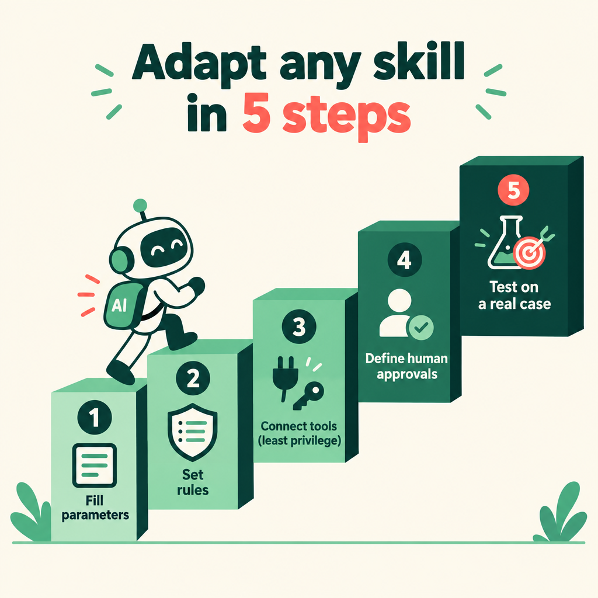
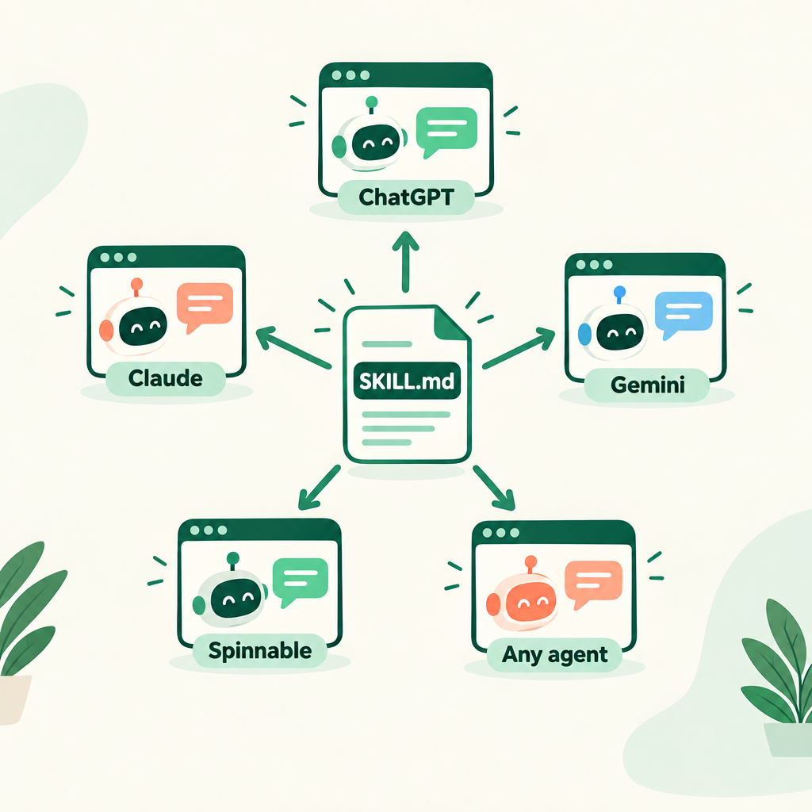

# I Built the Product. Then I Had to Learn How to Sell It.

### How I turned my search for the first pilots into 16 AI skills, and how you can install them in ChatGPT, Claude, Gemini or any AI worker

By Elio Fernandes, founder of Flix Home · Licensed under CC BY 4.0


I'm a builder. I built Flix Home, a tool that gives short-term rental managers control and visibility over their whole property portfolio. Building was the part I knew how to do.

Then came the part nobody teaches you: finding real prospects and getting the first ones to consider a pilot.

**This is not a success story. Not yet.** As I write this, I have no paying customer and no pilot running. What I do have is a method. It is written down as 16 skills that my AI workers run every week, so every attempt starts from what I learned last time instead of from zero.

This article covers that method, the mistakes that shaped it, and how to copy it for your own product.

---

## 1. Where I started: 91 emails, zero replies



Between late June and mid-July I sent **91 cold emails to 31 property management companies**: three emails each, over two weeks.

I got **zero replies**. No bounces and no opt-outs either. Just silence.

Looking back, volume was not the problem. These were:

- **I led with what the product does**, not with what the manager worries about.
- **Every email sounded like every other SaaS email.**
- **I had no way to learn from the silence.** I kept no clean record of what was sent, from which account, with which subject and with what result.
- **The work restarted from scratch every time,** so mistakes repeated: a wrong email address, a lead treated as new when it had already been contacted, a meeting logged as “near agreement” when nothing had been agreed.

So I changed three things: I open with the manager's problem—control and visibility over the portfolio. I ask one question. I propose one small next step. I also stopped relying on cold email alone. Those 91 cold emails produced zero replies and did not lead to the two discovery meetings that followed: one came through a LinkedIn contact, the other through an introduction by an angel investor. Both conversations led to a 60-day pilot proposal; both are still open. No pilot is running and I have no paying customer yet. Warm introductions and referrals produced the conversations, not that cold-email campaign.

---

## 2. The idea: every repeated task becomes a skill

A **skill** is a written method: steps, rules, limits and the expected output. It is not a prompt you retype. It is a file the AI reads every time it does that job.

Once I had written down how I prepare a call, how I follow up after a discovery meeting and how I review my week, my AI workers could take over the preparation. That left me the conversations.

The most important design choice was **what goes where**:



| Element | What it stores | Example | Where it lives |
|---|---|---|---|
| **Skill** | The method: steps, checks, limits, output | "Check the CRM and the email thread before drafting a reply" | A versioned .md file |
| **Memory / context** | Facts that change: status, dates, links | "This lead asked us to come back after the 17th" | A context folder, with a source and a date for every fact |
| **Decision log** | What was decided, by whom, when, and what it replaces | "From today, first emails never mention price" | A decision register |

If you put changing facts inside a skill, it quietly goes stale. If a suggestion slips into the decision log, it turns into a false commitment. Keep the three apart.

---

## 3. My workflow, end to end



This is the loop my AI workers and I run every week:

1. **Find:** pick leads from an approved list and check they have never been contacted.
2. **Contact:** write the message, have it reviewed, and send only after I say yes. Then log it in the CRM the same day.
3. **Talk:** prepare a one-page sheet before each call or meeting. After the meeting, turn the transcript into facts, proposals, decisions and open questions. These are four different things.
4. **Propose:** write a factual recap and, separately, a pilot proposal.
5. **Measure:** once a pilot starts, track it against a success metric agreed before its start.
6. **Review:** every Friday, run one review that updates the scorecard, the risks and the decisions I need to make. Anything I decide goes back into the context, so the next run starts from the current picture.

---

## 4. Five lessons that changed how I prospect

### 4.1 Open with their problem, not your features



Every message follows the same order: **context → relevance → one question → one light next step.** If I have no real, sourced observation about the company, I leave the personalisation out. Invented personalisation reads worse than none.

Before anything goes out, the draft is scored on seven points: **clear, relevant, natural, specific, one next step, proof, brief.** If it fails two or more, it gets rewritten.

Follow-ups without a reply move through three steps, each lighter than the one before:

1. Bring back the context.
2. Add something new and useful.
3. Give an easy way out, and ask who the right person is.

### 4.2 Ask for the meeting early, and ask for the right person

From Sam Nelson's *Cold Calling Essentials*: a call has only three acceptable endings. **A meeting booked, the name of the right person, or a clear no.** "Send me some information" is usually a polite no. Send it, but propose 20 minutes to go through it together.

Asking "who should I be talking to?" is the most underrated question in early sales.

### 4.3 A human says "send"


My review skill can say a text is good. **Only I can say it goes out,** to whom, and from which account. "Editorially approved" does not mean "authorised to send".

When the AI is missing a tool, a permission or a source, it reports an honest pending item. It never claims it did something it couldn't do.

### 4.4 Define pilot success before the pilot starts



This one comes from Mark Roberge's *The Science of Scaling* and changed how I write pilot proposals. Success is the **P**roportion of an eligible population reaching a concrete **E**vent within a **T**ime window.

The metric goes into the proposal as a hypothesis, and gets measured at fixed milestones, for example day 30 and day 60. When there is no data, the report says "evidence missing". Interest, a nice meeting or a letter of intent is not usage.

The proposed pilots are 60 days at no cost, framed as an **exchange, not a freebie**. A participating team would give access to its real process, name one responsible person, give weekly feedback and join a review on day 60. These are proposed terms, not an accepted agreement. I never lead with “free”. I lead with the problem.

### 4.5 Know your real competitor: the spreadsheet



Adapted from HubSpot's *30-Minute Battlecard Builder*: one card per alternative, and the most common alternative is **the status quo**, spreadsheets and chat groups. Every objection gets a two-sentence answer: acknowledge the concern, then redirect with a question.

When you have no proof of your own yet, the card says **"evidence missing"**. Don't borrow someone else's case study. Review the cards every two weeks, and mark any card older than three months as stale.

---

## 5. The 16 skills at a glance

| # | Skill | What it does | Human approval |
|---|---|---|---|
| 1 | Prospecting & Outreach | Contacts eligible leads without duplicates | Contact, message, recipient, channel |
| 2 | Commercial Messages | Context → relevance → question → next step; two versions + 7-point test | Explicit send approval |
| 3 | External Text Review | APPROVED / FIX verdict on claims, numbers, maturity, links, sender | Editorial only |
| 4 | Call Prep | One-page call sheet, real time slots, objections | Eligibility and any follow-up |
| 5 | Meeting Prep | Confirms time/zone/link, context, five questions, cautions | Invites, recording |
| 6 | Meeting Notes to Record | Separates facts, proposals, decisions, actions, open questions | Ambiguous decisions |
| 7 | Follow-up & Pilot Proposal | Factual recap + separate pilot proposal with P-E-T | Scope, terms, recipient, text |
| 8 | Validation & Readiness Metrics | P-E-T per pilot, weekly funnel, quarterly readiness score | Changes to P-E-T |
| 9 | Competitive Battlecards | Three views per alternative, two-sentence answers | Any external reuse |
| 10 | Weekly Operating Review | Scorecard, risks, decisions needed | Pending decisions |
| 11 | Decision → Context Pack | Logs explicit decisions, updates context, briefs the team | Interpretation |
| 12 | Investor Update | Know / Testing / Don't know yet, auditable numbers, one ask | Each version and recipient |
| 13 | Inbox Triage | Urgent / Action / FYI / Low priority | Archive rules |
| 14 | Email Reply Drafting | Replies in the owner's style | Every send |
| 15 | Daily Calendar Briefing | Today's meetings, prep, focus blocks | Channel |
| 16 | Weekly Calendar Review | Conflicts, load, focus time | Any reschedule |

Every template has the same structure: **Objective · When to use · Inputs · Output · Human approval · Common mistakes · Steps · Copy-paste prompt.**

---

## 6. Adapt them to your product in five steps



1. **Fill in the product parameters** below. Each field needs an owner, a source and a date.
2. **Write your communication rules:** allowed claims, banned words, and what you never promise.
3. **Connect tools with least privilege:** only the accounts and permissions the skill needs.
4. **Name the approver:** who says yes, and to what exactly.
5. **Test on one real case,** compare the result with the sources, then fix the method as well as the output.

Put this block at the top of every skill. An empty field blocks the actions that depend on it. It never gives the AI permission to guess.

```text
## Product parameters
PRODUCT: {{factual name and description; source/date}}
ICP: {{segment and target decision-maker}}
PROBLEM: {{observed pain, or a hypothesis marked as such}}
VALUE PROPOSITION: {{allowed wording and limits}}
MATURITY: {{available / in validation / planned; evidence}}
SENDER: {{approved account and visible identity}}
APPROVER: {{who gives explicit authorisation}}
CRM: {{system, owner, write rules}}
FORBIDDEN WORDS: {{terms and promises that never appear externally}}
CLAIMS ALLOWED WITH SOURCE: {{claim | source | date}}
PRICE: {{validated / in validation; how to talk about it}}
```

---

## 7. Install them in any AI tool



A skill is plain Markdown, so it works anywhere a model can read instructions. Keep **one file per skill**:

```markdown
---
name: commercial-messages
description: Writes one commercial message (email, follow-up, LinkedIn, WhatsApp) using context → relevance → question → next step, with a 7-point test. Never sends.
---

# Commercial Messages
## When to use
## Inputs
## Steps
## Rules and forbidden words
## Output
## Human approval
```

**Where to put it:**

- **ChatGPT:** create a Project or a custom GPT. Paste the skill into the instructions, or upload the .md files as project files. Then ask: *"Use the Commercial Messages skill to draft a follow-up to…"*
- **Claude:** add the files to a Project's knowledge or instructions. Or package each skill as a folder with a `SKILL.md` file (like the one above, with `name` and `description` at the top) and add it as a Claude skill. In Claude Code, put it in `.claude/skills/<skill-name>/SKILL.md`.
- **Gemini:** create a Gem and paste the skill as its instructions.
- **Spinnable:** send the .md file to your AI worker and say *"save this as a skill"*. The worker keeps it, runs it with your connected tools (email, Drive, CRM) and can run it on a schedule, such as the Friday review.
- **Any agent framework:** load the file as the system prompt or tool instructions for that task.

Menu names change often, so check each tool's current docs. The rules don't change: **connect only the access you need, and keep the human approval step.**

---

## 8. Where I am now

I use the same format I use with my mentors:

- **What I know:** the 91 cold emails got zero replies. Warm introductions got me conversations; cold email alone did not. Writing the method down stopped the same mistakes from repeating.
- **What I’m testing:** whether a proposed pilot can turn into paid use, whether my success metric is the right one, and whether introductions and referrals can become a repeatable channel alongside revised cold outreach.
- **What I don't know yet:** the right price, and whether this works beyond my first city.

I'll write the next part when the first pilot has run its 60 days, whatever the result.

---

## 9. Start this week

1. Pick **one** task you repeat every week, like a follow-up email or a weekly review.
2. Write down how you did it last time, including the mistakes you fixed.
3. Copy the matching template, fill in the parameters and name the approver.
4. Run it once under supervision and fix the method, not just the output.
5. Only then schedule it, or hand it to an AI worker.

**Get the templates:** [browse the skills/ folder of this repository](../skills/).

---

## Credits

These skills are **adaptations, not copies**. No long passages are reproduced. Thank you to:

- **HubSpot**, *Cold Calling Essentials*, by **Sam Nelson**: asking for the meeting early, three acceptable endings for a call, asking for referrals, handling objections.
- **HubSpot / The Science of Scaling**, *The 30-Minute Battlecard Builder*: fast competitive research and two-sentence objection answers.
- **Mark Roberge**, *The Revenue Leader's Guide to Scaling* (*The Science of Scaling*): P-E-T, readiness signals, and why scaling too early is dangerous.
- **HubSpot**, *The Partnership That Built doola*: the idea of testing partners as a growth channel.

Thresholds and conclusions in your own use depend on your own data.
