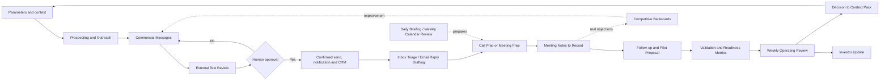

# How the skills connect

The loop must retain source and status at each transition. Approval of content does not automatically apply to future recipients or new versions; changed decisions feed back into context and affected skills. Calendar and inbox are aids, not sources of truth for agreements or product usage.
